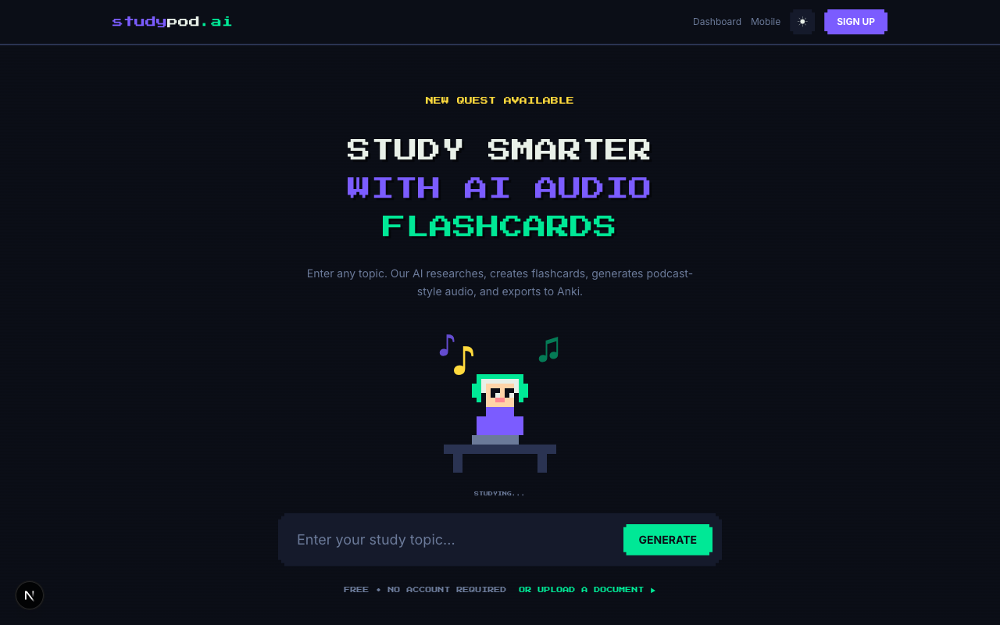
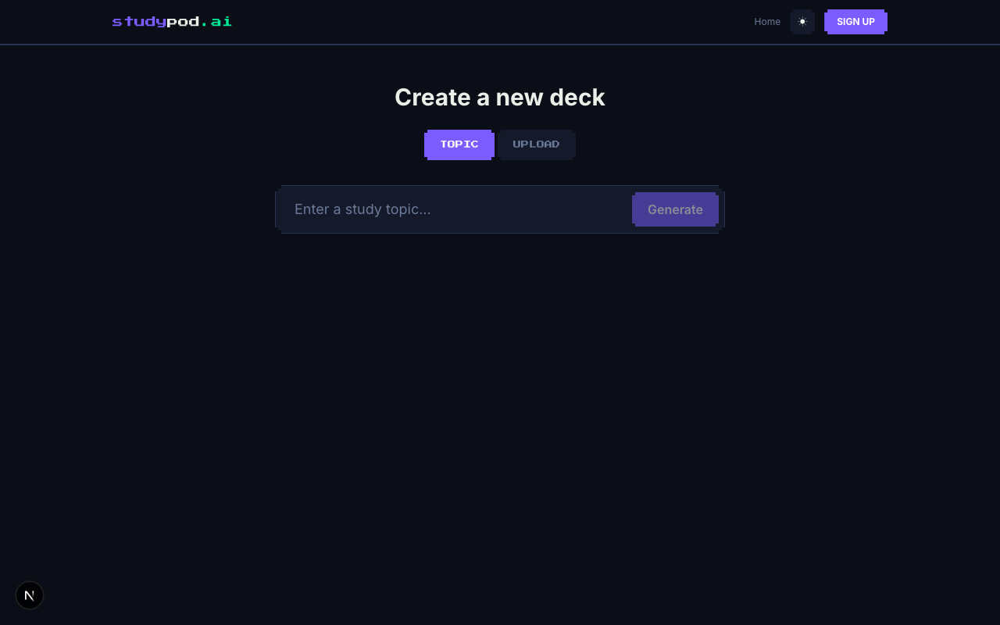

# studypod.ai

AI-powered audio flashcard generator. Enter any topic or upload a document — the AI researches it, generates flashcards, creates podcast-style audio dialogues, and exports to Anki.



## Features

- **AI Research** — Gemini deep-dives any topic and extracts key concepts
- **Flashcard Generation** — fact-checked Q&A cards with explanations
- **Audio Dialogues** — two-host podcast-style MP3s via hybrid TTS
- **Anki Export** — download `.apkg` decks for spaced repetition
- **Document Upload** — generate cards from your own PDFs and notes
- **Spaced Repetition Review** — built-in SRS with SM-2 scheduling
- **Gamification** — XP, levels, streaks, daily quests, combos, and badges
- **Mobile Listening** — subscribe via podcast apps or listen in-browser



## Tech Stack

- **Framework:** Next.js 16 (App Router)
- **Database:** Supabase (Postgres + Auth)
- **AI:** Google Gemini for research & generation
- **TTS:** Hybrid text-to-speech for audio dialogues
- **Styling:** Tailwind CSS v4 with a retro pixel-art theme
- **Language:** TypeScript

## Getting Started

```bash
# Install dependencies
npm install

# Set up environment variables
cp .env.example .env.local
# Fill in your Supabase and Gemini API keys

# Run the dev server
npm run dev
```

The app runs on `http://localhost:3011`.

## Environment Variables

| Variable | Description |
|---|---|
| `NEXT_PUBLIC_SUPABASE_URL` | Supabase project URL |
| `NEXT_PUBLIC_SUPABASE_ANON_KEY` | Supabase anonymous key |
| `GEMINI_API_KEY` | Google Gemini API key |

## License

[MIT + Commons Clause](LICENSE.md) — free for personal and non-commercial use. Commercial use (selling the software or offering it as a hosted service) requires a separate license.
